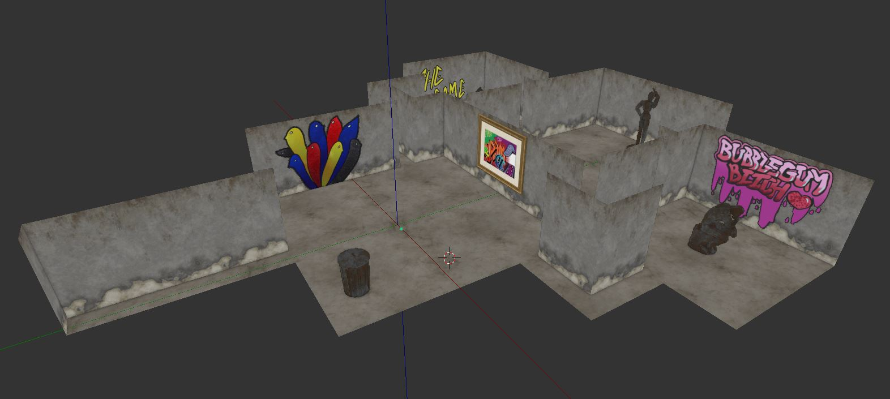

# CSE389 OpenGL Museum Project
Created by [Nyna Dunning](https://github.com/raikazz) & [Benjamin Mastripolito](https://github.com/Lemoncreme)

## Specification
Call `cmake .` then `make` to compile. `./Museum` to run museum program. 
Museum requires OpenGL 3.3 or higher.

## Requirements
Requires the following libraries to compile properly:

- Assimp
- GLFW3
- GLAD (included)

## Notes
All models including the paintings and the sculptures are included inside both `model/museum_final.blend` and `resource/museum.obj`.

## How To Use
- Escape - Exit museum
- Scroll Wheel - Zoom
- WASD - Movement

## Museum Model
Fully textured model in Blender:

The model .blend file is located in `model/`

## In-program Screenshots

## Museum Plan

### Theme
Our theme is brutalist architecture / urban art. We will be using a lot of hard edges and sharp angles in our museum design. Here is an [image reference](https://cdn-images-1.medium.com/max/2000/1*S6RfbHdsLvjOzgl0dWhzgA.jpeg).

### Layout
The museum will include *at least* two rooms. We plan to add more if we feel confident we can accomplish all other vital parts of the museum program.
We might include a ceiling depending on time constraints.
The textures we will be using for our museum will be mostly concrete and other rough, stone-like surfaces.
Our sculpture will resemble a "found items" type artwork. We're not certain about the final shape, but it will be made up of smaller items. We plan to create our own models for this. 
Finally, our paintings will include urban street art such as graffiti, murals, etc. 

## Resources Used
- [LearnOpenGL Libraries](https://learnopengl.com/): camera.h, shader.h, model.h, mesh.h in `include/`
- [Single File Libraries](https://github.com/nothings/stb): stb_image.h
- [Blender](https://www.blender.org)
- [Dummy Model](https://www.turbosquid.com/3d-models/free-obj-mode-dummy/662719)
- [Fire Hydrant Model](https://www.turbosquid.com/3d-models/free-hydrant-3d-model/1006257)
- [Thinker Model](https://www.thingiverse.com/thing:34343)
- [Filter Forge](https://www.filterforge.com) for textures
