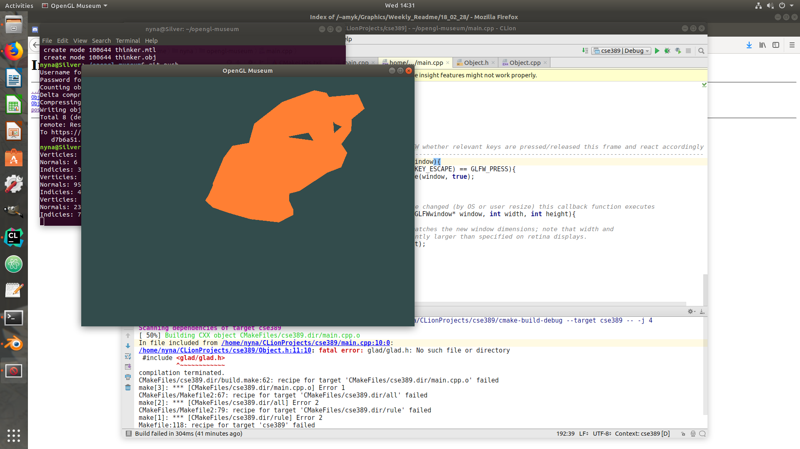
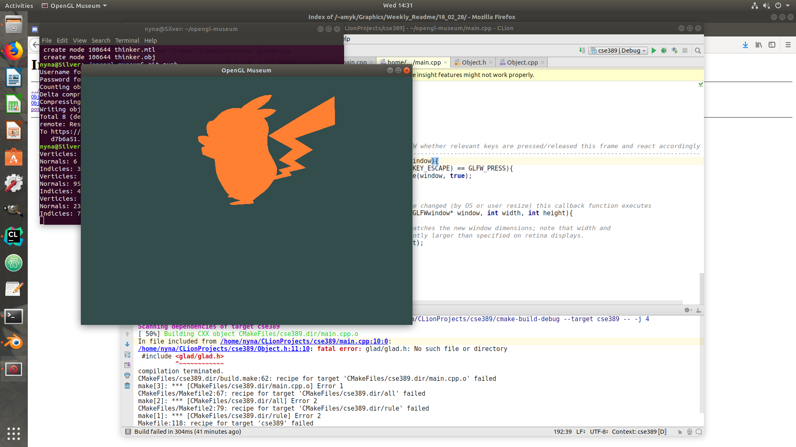
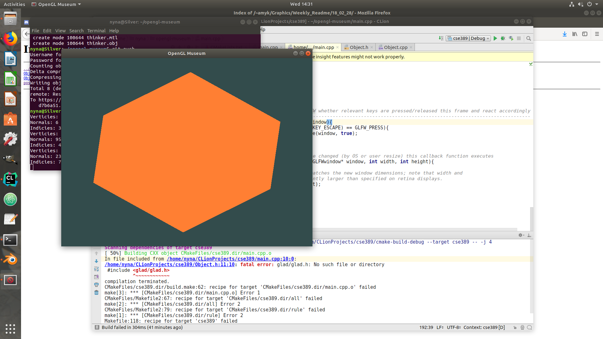
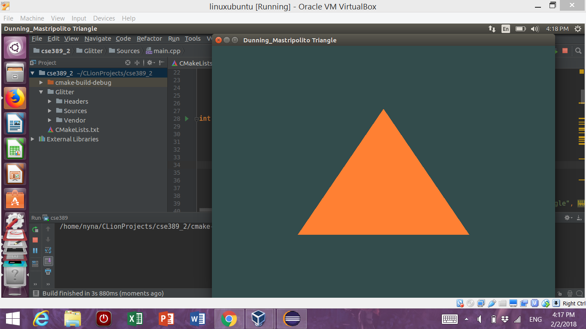

# CSE389 OpenGL Museum Project
Nyna Dunning & Benjamin Mastripolito

# How To Use
Spacebar - Cycle through models

Mouse Click - Mouse click and drag to rotate models

Up/Down - Zoom

Scroll Wheel - Zoom

# Museum Model
[Link to museum model](https://github.com/Lemoncreme/opengl-museum/blob/master/museum_final.blend)
Textured model:

# Screenshots

## Museum Plan

### Theme
Our theme is brutalist architecture / urban art. We will be using a lot of hard edges and sharp angles in our museum design. Here is an [image reference](https://cdn-images-1.medium.com/max/2000/1*S6RfbHdsLvjOzgl0dWhzgA.jpeg).

### Layout
The museum will include *at least* two rooms. We plan to add more if we feel confident we can accomplish all other vital parts of the museum program.
We might include a ceiling depending on time constraints.
The textures we will be using for our museum will be mostly concrete and other rough, stone-like surfaces.
Our sculpture will resemble a "found items" type artwork. We're not certain about the final shape, but it will be made up of smaller items. We plan to create our own models for this. 
Finally, our paintings will include urban street art such as graffiti, murals, etc. 
